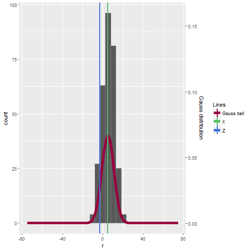

Getting probability
========================================================
author: Carlos José Manosalva
date: November 3/2017
autosize: true

Getting probability
========================================================

This tool allows you find the probability to getting a range of number between -75 to 75, you just have to move the slider to set the mean, standard deviation and the range Z and X.

Getting probability
========================================================
Given to normal distribution of 300 records, you can know the probability, according to the Z and X, besides, you can see the graphic representation of:<br />
Histogram<br />
Gauss bell<br />
Real time ubication of Z and X<br />

```r
library(ggplot2)
r <- rnorm(300, m=5, 6)
x <- seq(-75,75,length=300)
y <- dnorm(x,mean=5,sd=6)
data = data.frame(r,y,x)
```

Getting probability
========================================================
left: 40%
Remember<br />
  - Z: Blue vertical line.<br />
  - X: Red vertical line.<br />
  - Gauss bell: Red curve.<br />
  - Histogram: grey bars.<br />
  
***



Getting probability
========================================================
Please, click on this <a href="https://carlosjm5.shinyapps.io/Example/">link</a> to go to the app and click <a href="https://github.com/carlosjm007/Data-products-proyect">here</a> to go to the de code on github
